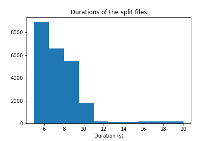

# TASK 6: speech to text experiments

An [example](https://huggingface.co/blog/fine-tune-xlsr-wav2vec2) was reconstructed as an excercize. Some observations:
* A lot of workarounds were implemented to make the model work and not all of the aspects are as of yet clear to me
* Training time for 30 epochs was about 2h.

Discuss which evaluation metric to use (WER? PER?)

# Addendum 2021-12-03T08:18:03

The virtual machine does not have the necessary tools installed to convert the flac files to wav. I therefore migrated all the files to my computer and converted them there. The disk only has 14G of free space, meaning that in case the wav dataset is bigger than that, I will need to delete the original flacs.

I noticed that I also had the chance to downsample the original 44100 Hz sampling rate to the recommended 16000 Hz. In this conversion filesize dropped to about 33% of the original size, meaning that we will probably be ok regarding disk space on the virtual machine.

For posterity: file inspection was done with `soxi file.wav`. Conversion was performed using `ffmpeg -i 00023289.flac -ar 16000 brisi.wav`

After copying files back to VM, some toying was necessary to get it to load properly, but finally it was discovered how to do it.

The vocabulary found in the normalized transcripts is as follows: `{' ', '*', ':', ';', '?', 'a', 'b', 'c', 'd', 'e', 'f', 'g', 'h', 'i', 'j', 'k', 'l', 'm', 'n', 'o', 'p', 'q', 'r', 's', 't', 'u', 'v', 'w', 'x', 'y', 'z', 'ä', 'ü', 'ć', 'č', 'đ', 'š', 'ž'}`. I will not transform non-Croatian characters now, but I will remove special characters (e.g. `*`, `:`...)

I noticed that the substitutions take a long time. It might be better to do it in `pandas` in the future.

I performed a train-test split randomly without setting the random seed. Train size was set to 0.8, meaning that 18430 instances were in the training split and 4608 were in the test split.


# Addendum 2021-12-03T14:04:13

The model would not train due to CUDA Out of memory errors. My usual trick `import torch;torch.cuda.empty_cache()` did not work and the `nvidia-smi` output showed there was still a lot of memory allocated to my processes. Fortunately this error is so ubiquitous that I found another approach:
```
from numba import cuda
cuda.select_device(0)
cuda.close()
cuda.select_device(0)
```

This successfully released CUDA memory. Training is done via the Trainer module, but for some unknown reason every time the training starts, something stalls the process for about 10-15 minutes, and then the training either starts or crashes, meaning that debugging is time-consuming. It also means that the README will probably be bloated again, because it gives me time to complain and log all difficulties and attempted fixes.

# Addendum 2021-12-03T17:07:06

It had been discovered that none of the tricks prevent the training from crashing. To explore further I first dropped the number of `per_device_train_batch_size` to 4, but to no avail. In the next step I only read 10k instances. It did not work. With the reduced dataset I proceeded to further reduce the batch size to 1. This worked. I therefore increased the batch size to 2 and tried again. If this works, the dataset will be expanded to use full data. It did not.

# Addendum 2021-12-06T07:40:36
To get it to work I clipped the audios as demonstrated in the example:
```python
max_input_length_in_sec = 5.0
train = train.filter(lambda x: x < max_input_length_in_sec * processor.feature_extractor.sampling_rate, input_columns=["input_length"])
```
The batch size was 2 and the first training episode ran OK with 2.5 it/s. Unfortunately the evaluation was way slower and crashed at the very end:
```ValueError: number of ground truth inputs (24) and hypothesis inputs (0) must match```

I opened a new notebook and repeated the pipeline again in case I missed some steps. It seemed the training was even slower this time somehow... I clipped all instances at 20s and set the train batch size at 2. The problem now arises at the evaluation stage. For some reason there is a ValueError raised at the point of evaluation. The weird thing is that the error gets raised at the very end of the evaluation. Probably this means that the speech2text works and only the evaluation crashes.

I tried rerunning the training pipeline with CER metric disabled, with a reduced dataset that only reads 2k files. That seemed to work, so I proceeded with training on the full dataset. For now I still have the length clipped at 5s.

Current speed is about 0.2 it/s when training and 0.5 it/s when evaluating. Per device train batch size was increased to 16.

# Addendum 2021-12-06T13:28:12

First and second evaluations inspire hope: WER 0.43 and 0.30. Total training time seem to will have been about 3h.

Training stats: 
| Step | Training Loss | Validation Loss | Wer      |
| ---- | ------------- | --------------- | -------- |
| 400  | 3.309800      | inf             | 0.438042 |
| 800  | 0.459100      | inf             | 0.300283 |
| 1200 | 0.215900      | inf             | 0.282470 |
| 1600 | 0.107500      | inf             | 0.257122 |
| 2000 | 0.058700      | inf             | 0.245714 |

To do: implement filtering in the dataset construction part to allow for more elegant choice of input lengths.

File sizes in kB are distributed as follows:

```
                            Distribution of filesizes                         
    ┌────────────────────────────────────────────────────────────────────────┐
4422┤ ▐█▌                                                                    │
    │ ▐█▌                                                                    │
3685┤ ▐███▌                                                                  │
    │█████▌                                                                  │
    │█████▌                                                                  │
2948┤███████                                                                 │
    │███████                                                                 │
2211┤█████████                                                               │
    │█████████                                                               │
    │█████████▄▖                                                             │
1474┤██████████▌                                                             │
    │████████████▌                                                           │
    │████████████▙▄▖                                                         │
 737┤██████████████▙▄                                                        │
    │██████████████████                                                      │
   0┤███████████████████████▙▄▄▄▄▄▄▄▄▄▄▄▄▄▄▄▄▄▄▄▄▄▄▄▄▄▄▄▄▄▄                ▗▄│
    └┬─────┬──────┬──────┬──────┬───────┬──────┬──────┬──────┬───────┬───────┘
    18.8 293.0  658.0  1023.0 1388.0  1753.0 2118.0 2483.0 2848.0  3213.0     
[y]                               Size in kB [x]                              

```

1200kB means length of about 31s, which means I can probably discard everything after 1000kB and hardly change the dataset size and hopefully keep the pipeline from crashing.

So far the automatic checkpoint deletion works like a charm.

A similar histogram can also be plotted for word count and we find they are quite similar:


# Addendum 2021-12-07T07:56:20

I had a mad dream that I would let the model train on 30s data during the night. Unfortunately the diskspace got so full that not only did the training fail, open files were corrupted and manual recovery was needed to get them back.

I therefore opt to first load the model from yesterday and evaluate it on the test data. A new notebook shall be opened for this purpose.

# Addendum 2021-12-07T09:24:56

I added an evaluation run that loaded the model from the disk, loaded dataset, and ground truths. Unfortunately, the behaviour was not stable enough to allow for transciption of the whole test dataset, I started getting RuntimeErrors due to Cuda OOM after a bit more than 500 instances.

Nota: The test dataset is not the same as the one used when training, as that one was lost due to disk errors stopping the pipeline. The instances could therefore be trained upon. This eval run should mostly be used as an inspection for possible suspicious behaviours discovered in the model.

I noticed that I don't really need CUDA to run the evaluation. With a few deletions I managed to get the evaluation to run waay longer than before. Why a simple evaluation reserved 30GB for pytorch, I still don't know.

I noticed that raw evaluation took a loong time, meaning that apparently the evaluation during training was faster in comparison with this.

When finished I prepare a new notebook for repeated training. Unlimited inputs crashed the training. This time I will try and use 30s of clips, which will cover the vast majority of data.

# Addendum 2021-12-07T14:32:33
As it turns out, this is a major obstacle. The training speed dropped to 0.1 it/s, the progress bar says the total training time will be over 30h. But it does run! To prove it right I will wait a bit and then decide what to do.

# Addendum 2021-12-08T07:54:27
Clipping audio at 30s did not work, but I managed to train the model about 15 epochs at 20s. The model crashed somewhere in the middle from unknown reasons, perhaps due to my VPN resetting and dropping the Jupyter session. The metrics are optimistic:
| Step | Training Loss | Validation Loss | Wer      |
| ---- | ------------- | --------------- | -------- |
| 400  | 3.254200      | inf             | 0.335134 |
| 800  | 0.381700      | inf             | 0.203421 |
| 1200 | 0.238100      | inf             | 0.214364 |
| 1600 | 0.183300      | inf             | 0.181068 |
| 2000 | 0.147100      | inf             | 0.177198 |
| 2400 | 0.120200      | inf             | 0.167918 |

I retain the last checkpoint, meaning that even with the interrupted training I can continue to build on the shoulders of the half-finished giant that crashed. *Tried that, could not get it to train properly.*

## Alignment

* `afalinger` and `aeneas`: would not pip install. There is a really convoluted option for installing in a virtual machine, but I hope to avoid that. There is a bunch of gcc errors that for now I cannot get rid of.
* `align` installs, has shitty docs. Is not intended for audio-text alignment, but for comparing two transcripts.
* `pyfoal`: installation OK. Can't get it to work. I solved one problem (calling shell command HCopy instead of hcopy from a package I hadn't installed previously), but now it wants to call HVite, which is unclear what it is and does.
* `FAVE-align`: expects not only text, but speaker ID, names, breath groups, and finally also text. Convoluted, to say the least.


# Addendum 2021-12-08T10:25:38

I found a fork of `aeneas` that works. The nontrivial part of next steps is splitting the sentences in a meaningful way. Normalized sentences contain no punctuation or capitalization, especially due to the origin of the data, reading them is like reading James Joyce.

In a first attempt I created a text transcript, where I replaced every 10-th space with a newline character. I ran `aeneas ` on my laptop and found that it even supports Croatian language. The troubling part however, is that there are some parts of the transcripts that have zero length. I shall investigate those manually to discern what is going on.

It seems that the aligner reads the duration correctly, but especially in the end part of the audio file the alignments are pretty much useless. In the beginning part, the transcripts are longer than they really are in the audio file (e.g. 15s segment is labeled as being 18.4 seconds long.)

MEETING NOTES:
* Use _my model_ to segment long instance, not `aeneas`.
* First task: get temporal information on the transcripts
* https://distill.pub/2017/ctc/
* https://github.com/huggingface/transformers/issues/11307
* Character level, starts and ends, the more information, the better. #Moreismore
* This information should be recoverable from the prediction
* Next task: identification of pauses, data cleaning... to be discussed in the future meetings.
* Try to improve the speed and produce consistent behaviour; try keeping the vector size flexible.
* How does the excess of transcripts or audio influence the performance of the model?


# Addendum 2021-12-09T09:52:30

I first implemented a word-level temporal data extractor. The results are very inspiring. I manually annotated the first `wav` file:


The resuls agree quite nicely:

| ML transcription | M:start | M:end |  H:start |   H:end  | Human transcription |
|------------------|:-------:|:-----:|:--------:|:--------:|--------------------:|
| poštovane        |  0.401  | 0.862 | 0.370798 | 1.112394 |           Poštovane |
| kolegice         |   1.66  |  2.03 | 1.558234 | 2.171817 |            kolegice |
| ikolege          |   2.13  |  2.49 | 2.171817 | 2.573514 |             kolega? |
| zastupnici       |   2.63  |  3.33 | 2.573514 | 3.387946 |          zastupnici |
| molio            |   4.15  |  4.33 | 4.103056 | 4.372326 |               molio |
| bi               |   4.39  |  4.41 | 4.372326 | 4.462818 |                  bi |
| da               |   4.49  |  4.53 | 4.462818 |  4.59966 |                  da |
| nastavimo        |   4.61  |  5.19 |  4.59966 | 5.222071 |           nastavimo |
| sa               |   5.31  |  5.41 | 5.222071 | 5.606112 |                  sa |
| radom            |   6.3   |  6.68 | 6.232937 | 6.716299 |               radom |
| sjednice         |   6.76  |  7.18 | 6.716299 | 7.310017 |            sjednice |

Gold truth: `poštovane kolegice i kolege zastupnici molio bi da nastavimo sa radom sjednice `

The glaring mistake is of course in row 3, i.e. `ikolege`. I heard no distinct `i` phoneme, but it makes sense for it to be there. There is also a more suble error between my annotation of `kolegice` and the start of machine annotated `ikolege`, but this is around 40 ms, which is probably lower than my annotation precision.

Other than that I think this performance is amazing. Word level temporal data extraction is still possible to evaluate by hand, I doubt I will be able to process the document on phoneme level with the same certainty as I was on word level.

I also wanted to transcribe the longest recording, because I know how bad it performed in `aeneas`. This was unfortunately not possible due to OOM issuses. I tried another file (`9874.flac`):


| ML transcription | M:start | M:end |  H:start |   H:end  | Human transcription |
|------------------|:-------:|:-----:|:--------:|:--------:|--------------------:|
| a                | 0.382   | 0.382 | 0.288851 | 0.443237 | a                   |
| o                | 0.482   | 0.502 | 0.443237 | 0.555291 | o                   |
| tome             | 0.603   | 0.804 | 0.590153 | 0.971138 | tome                |
| govori           | 1.17    | 1.41  | 1.065761 | 1.489078 | govori              |
| itematika        | 1.47    | 2.07  | 1.533899 | 2.129032 | tematika            |
| zbog             | 2.19    | 2.35  | 2.129032 | 2.373062 | zbog                |
| kojeg            | 2.45    | 2.65  | 2.373062 | 2.637012 | koje                |
| su               | 2.77    | 2.83  | 2.637012 | 2.866101 | su                  |
| se               | 2.91    | 2.97  | 2.866101 | 3.050368 | se                  |
| sve              | 3.05    | 3.21  | 3.050368 | 3.36412  | sve                 |
| žalili           | 3.58    | 3.92  | 3.36412  | 3.936842 | žalili              |

Gold truth: `a o tome govori i tematika zbog kojeg su se sve žalili `


Again we see the same pathology (`itematika` and a minor mismatch with my annotations). What is interesting is that in this case we have some orphan data at the beginning of the recording, but in the transcript it is ignored.


# Addendum 2021-12-09T12:35:57

Next steps:
* Prepare schema for the split-aligner and report to Nikola

### What we want to do

Split-aligner should split large files (> 20s) into managable chunks, on which transcription is to be performed, pauses should be identified and then the splitting should be performed on those pauses such that all chunks satisfy length < 20s and gold transcripts should be aligned to them. In this way we can prepare a new dataset which will not break CUDA Memory nor discard valid data.

Case study of an imaginary instance (just for illustration purposes): length is in (20s, 40s):
```
file:    let's imagine there is some audio here.       after a pause, some more text here, but...       there was another pause.
time:                                                      10s                                           20s
cuts:                                                                                                    |
```
If we split right at 20s, we would mangle data. Let's start with the first chunk and transcribe it, with the time information extracted as well.
Based on our experiments from this morning, let's decide that we need a silence of 0.2s to _neatly_ separate two words. We might find *neat* separation by looking at the whole file in chunks with some overlap: first, we take the first 20s of data, process it, and then take chunk from 15s to 35s, process it, next from 30s to 50s... The transcripts then have to be reassembled with the cutting in mind; the times would have to be corrected for the offset and because of our definition of overlaps we would always have to correct the words at the cut with those from the next cut, as they might be mangled in the first case, but probably will not be in the second case (except if the word in question is longer than 5s, like `Supercalifragilisticexpialidocious`, and even that only takes 3s to say.)

Now we should have a complete timeline of the audio recording. This was the trivial part, and now the non-trivial part: separating the recording into pieces based on the pauses between words. I propose we lower the bar incrementally: let's start first with pauses of 1s and check for those. If we can split the file on those into chunks between 20s and 10s long, we exit the algorithm. If not, we lower the separation to 0.5s and try again. We could continue either by halving the separation in every iteration or by decrementing in a decimal fashion (0.5, 0.4, 0.3, 0.2). There is no reason to expect this to work for every file we encounter, so let's reserve the right to fail if we do not find a solution.

We said nothing on how to split the file based on the pauses, so let's address that now. I propose we brute force it in the following way: we have `n` pauses, with centroids at (t1, t2, ... tn). We therefore have `n**2` possible combinations which we can test individually and take the first splitting that satisfies our conditions. I planned to implement this recursively, but it's way easier to loop over the combinations and test those.

Once we find the pauses on which the file should be cut, we cut it in the centre of the pause, as it is the logical thing to do.

After the files are appropriately segmented, we assign them new portions of the gold transcripts. I propose we do that with the help of our transcripts. We know what our model outputs for the segment, and we know that it is a subset of the gold transcript. For `n` words we have two directions to trim; form the end or from the start. I coded an example function that finds the closest substring in the gold transcription. Nikola suggests using `difflib`, which is Python native, but I still have to get around the fact that the strings might be slightly different in the part where they need to match.

### Workflow:
1. Extract durations for all files in the dataset
2. Process those that are over 20s
   1. segment into overlapping chunks
   2. transcribe chunks
   3. join transcriptions
   4. generate pause locations
   5. identify nice splits
   6. cut the file in those splits
3. with the new files, align the old gold transcripts to fit the new splitting

### Prerequisites:
* Duration finding for wav files: python builtin `wave`? `pydub`?
* Elegant timebased cutting for wav files: ditto
* `itertools: combinations, chain`
* surely something to help with transcripts alignment, fuzzy string matching, levenshtein distance?

### Remarks:
* `pydub` seems to be optimal choice for wav file manipulations, it allows easy extraction of data, joining it, indexing temporal data directly by milliseconds instead of sample index...
* I think this would be a good use for `tempfile` module to neatly manage all the intermediate products.
* If this is to be shipped, dependancies have to be as pruned as possible => maybe stick to builtin datatypes instead of for example pandas?


### Notes:
* 20s might be too long for a sequence, shoot for 5-10s for finished instances
* Keep the data created in the proces for posterity.
* Another approach: first identify silences, chunk on those with duration <20s, then use the model on those chunks to possibly chunk further. In this case we would not need overlap and the logic for joining the overlapping transcripts.
* Don't reinvent the wheel with the alignment (bullet 3 from above.)
* Naming: when chunking `0002.wav`, create `0002a.wav, 0002b.wav`... If need be, we can use lowercase and uppercase in different stages of the process.

# Addendum 2021-12-13T08:13:09

I calculated the duration of the instances with `scipy.io.wavfile.read` and now I can replot the histogram with the durations in seconds. Not surprisingly, the shape of the distribution is identical, which makes sense since all the files have been preprocessed to have the same framerate, therefore duration and filesize directly correlate.


I also recalculated how many files are over our max processing limit and found about 3000 instances are longer than that.

Next step: silence finder. `pydub` offers a nice way to find chunks of silence that work pretty much like the `split_on_silence`, except that it does not return audio segments themselves, but instead only the brackets where silence is identified. We can use this to calculate the silences centroids and proceed from there with the framework we already put in place the previous week.


# Addendum 2021-12-14T09:07:18

My splitter has been debugged so that it works as intended. The problem arises in certain instances, where the splitter has to split on 200ms pauses and check 2^23 combinations, which is slow at best. I'm looking at divide-and-concquer implementation to possibly speed it up.

I opted for a two pronged approach with which I find the optimal solution in case the phase space is small dimensional, but for larger problems I use a heuristic for which I cannot prove that it's optimal. In a few hours I will have the splits ready.

During log inspection I had unfortunately found that the non-optimal faster algorithm could not find solutions for many of the larger files that would otherwise halt the execution. For these files a solution will have to be found afterwards.

# Addendum 2021-12-15T08:24:01

I reviewed the results from the splitting pipeline. In 82% the splitter found a good solution. In other cases, it failed, in most cases due to my non-optimal algorithm for finding the splits where a lot of silences had been identifies, which is more common on longer files.


This will be remedied in the next step. By manually inspecting instances where my processing failed I truly discovered some weird files, for instance one, where silences are found at (approximately) [0.1, 11, 13, 14, 17, 19, 20] seconds, and the file was 20.1 seconds long. It is really hard to find a suitable split here with our parameters, but if we relaxed the maximal length of a split to 15 instead of 10 seconds, we could make it work.

Still, not all files can be processed, although those cases are vastly less frequent than before. In manual inspection I found that it truly seems there can be no solution in these cases. For instance, one of the files has silences at [[6399.0, 34958.0, 38713.0, 45645.0, 47039.0] milliseconds. We can see there are really no splits that would satisfy our constraints as the second segment would be too long. I shall see what can be done with decreasing the silence threshold to a higher value. Right now all the silences have been identified with a threshold of -40dB, but if we raise that level to -30dB, we can identify enough silences to push through even with these troublesome recordings.

# Addendum 2021-12-15T12:59:07

Next we shall split also the files between 10 and 20 seconds as agreed in the Skype chat. This is a bit time consuming, as the majority of recordings are precisely in this bracket, but it's less stress, because even if the algorithms fail, we are content with 20s recordings. In a few hours I'll have the data and I'll be able to analyze them some more.

# Addendum 2021-12-16T08:22:48
This repeated splitting took some time, about 7h. Still some files were pathological enough to render the splitting impossible under the constraints we required, so now the distribution of original files that could not be split looks like this:


We can see that we get a lot of files that are too short to process, and a few longer files, that are still long enough to go in the model without any problems.

The files can now be split and passed to the classifier.


Meeting notes:
* When evaluating: use larger batches, because we now have smaller data instances
* Word starts and word ends need not be preserved, maybe keep them for diagnostics
* When able, publish the current model on HF MH. Put it directly to CLASSLA, make it public.
* Next week: VM is reserved for us, retrain a new model on new dataset.
* Tomorrow: meeting at 13? TBC
* Nuance?, iPhone dictation tech, can we compare it to ur model?

# Addendum 2021-12-17T15:45:12

The splitting is done, on all chunks transcription has been performed.

After splitting, the split files have the following duration distribution:



First words in the transcription start at different times. The distribution looks like this:


~~This is worrying, because we might have split some words in the middle if the pauses are not long enough. Some of these instances will be checked to ascertain the danger of this happening.~~
This was worrying, but after I used logarithmically spaced bins and not linearly spaced ones, I think the processed files being cut in the middle of the word is not such a wide spread problem.

Another problem lies with two files for which the model was not able to transcribe anything at all. These instances will also be checked.

Meeting notes:
* Re: start word times distribution: remove from analysis all first chunks
* Nikola will sample the files, if OK, a new model can be trained during the weekend.
* Finetuning shall be started from the original checkpoint (`"facebook/wav2vec2-xls-r-300m"`).